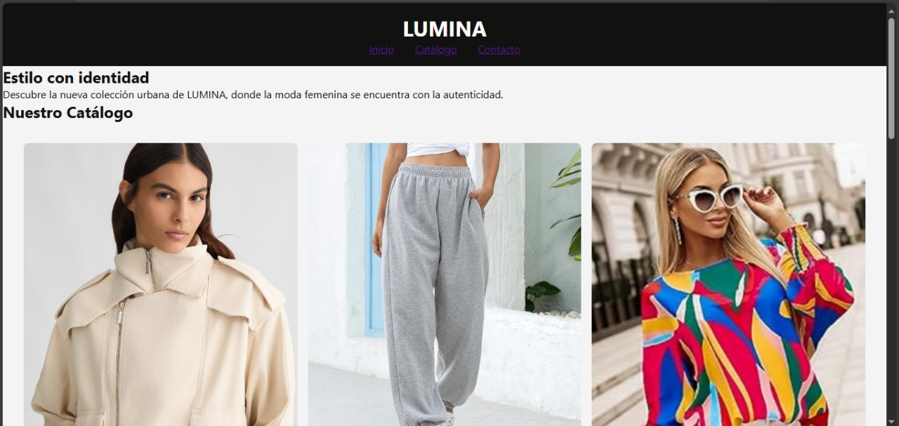

# LUMINA - Sitio Web de Moda Femenina

## Descripción del Proyecto

**LUMINA** es una marca ficticia de moda urbana femenina que busca reflejar estilo, autenticidad y elegancia en cada prenda. Este sitio web ha sido desarrollado como parte de un proyecto académico aplicando principios de diseño web, accesibilidad y desarrollo modular con HTML5 y CSS3.

## 🌐 Enlace al sitio web (GitHub Pages)

https://melaniaraceli.github.io/lumina-site/

## 📁 Estructura del Proyecto

LUMINA/
├── index.html
├── README.md
├── css/
│ ├── reset.css
│ ├── variables.css
│ ├── layout.css
│ ├── components.css
│ └── main.css
└── assets/
├── producto1.jpg – producto6.jpg
└── captura.png

## 🎨 Características del Sitio Web

- HTML5 semántico con secciones claras: `header`, `main`, `section`, `footer`.
- CSS modular dividido en reset, variables, layout, components y main.
- Galería de catálogo con sistema **CSS Grid** (mínimo 6 productos).
- Animaciones con `@keyframes`, `hover`, y transiciones suaves.
- Formulario de contacto accesible con etiquetas `label`.
- Ícono favicon personalizado para el navegador.
- Publicado usando GitHub Pages.

## 🧑‍💻 Datos del Autor

- **Nombre:** Melany Aracely Paredes Torres  
- **Curso:** Diseño Web  
- **Universidad:** Universidad César Vallejo  
- **Año:** 2025

